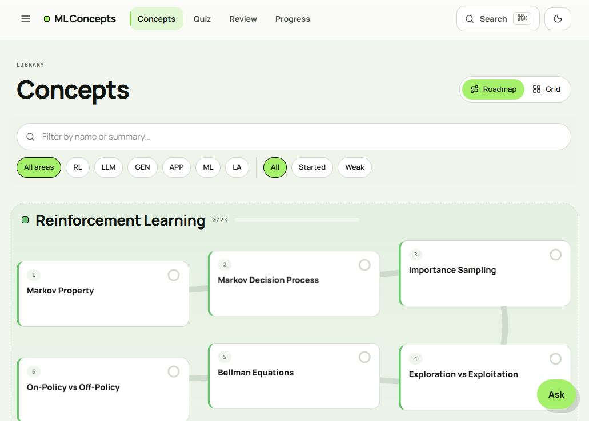

<div align="center">
  <h1>
    
    ML Concepts
  </h1>

  <p>
    A static-first learning app for revising machine-learning concepts with notes,
    quizzes, spaced review, highlights, and AI tutoring.
  </p>

  <p>
    <a href="https://ml-concepts.vercel.app/">
      
    </a>
    <a href="https://mc-marcocheng.github.io/ML-Concepts/">
      
    </a>
  </p>
</div>

<p align="center">
  
</p>

## Overview

ML Concepts helps learners review machine-learning topics through:

- concise MDX concept notes
- local quiz sessions
- spaced-review progress tracking
- search across concepts
- notes and highlights
- remote or on-device AI assistance

## Run locally

```bash
npm ci
npm run content:build
npm run dev
```

Open:

```text
http://localhost:3000
```

## Documentation

Full technical documentation is available in the docs site:

- [Getting started](docs/getting-started.md)
- [Architecture](docs/architecture.md)
- [Content authoring](docs/content-authoring.md)
- [Quiz authoring](docs/quiz-authoring.md)
- [Deployment](docs/deployment.md)

## Contributing

See [`CONTRIBUTING.md`](CONTRIBUTING.md) for development, content authoring, validation, and PR guidelines.
