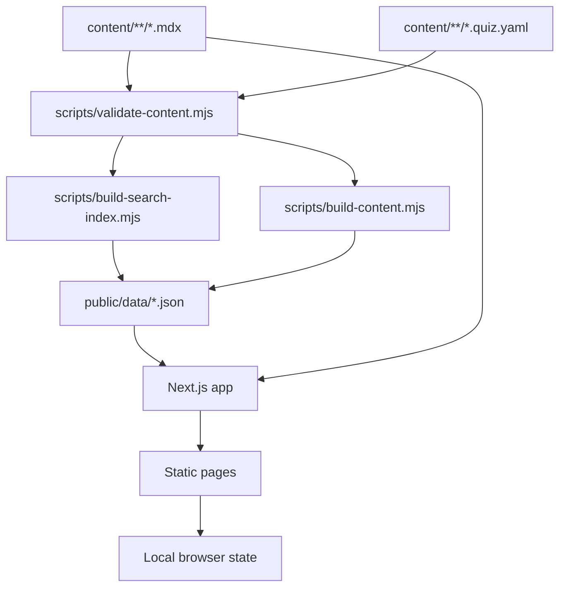
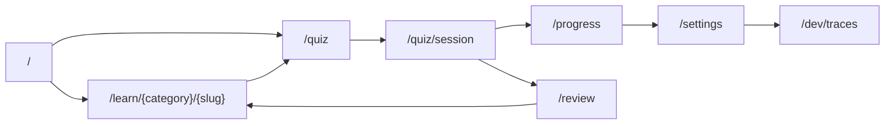
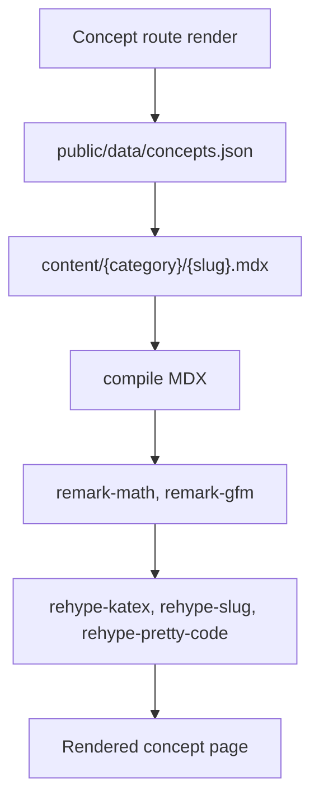
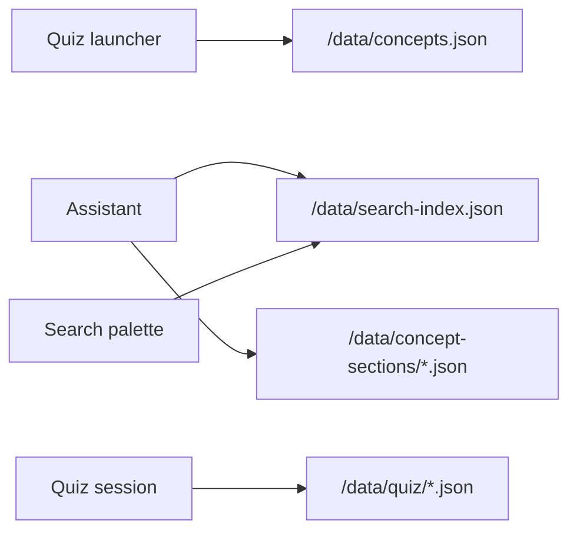
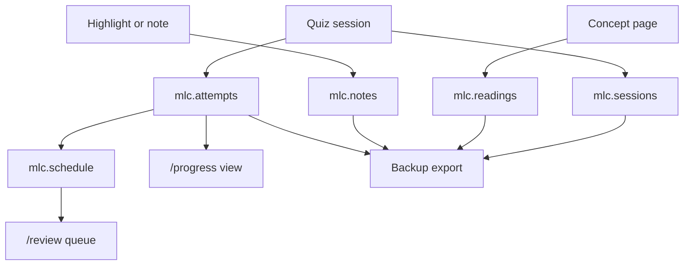
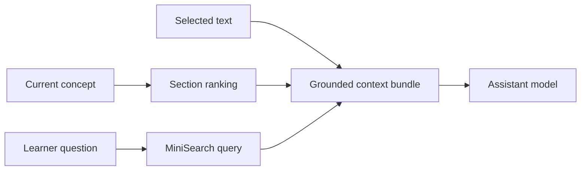

# Architecture

ML Concepts is designed as a mostly static application.

The authored source of truth is in `content/`. Build scripts convert that source into JSON files under `public/data/`, which are consumed by the Next.js app and client-side features.

## High-level flow



## Next.js App Router

Pages live in `src/app/`.

Important routes:

| Route | Purpose |
| --- | --- |
| `/` | Concept index |
| `/learn/[...slug]` | Concept page |
| `/quiz` | Quiz launcher |
| `/quiz/session` | Quiz session |
| `/review` | Due review queue |
| `/progress` | Local progress view |
| `/settings` | Assistant, storage, backup, theme |
| `/dev/traces` | Optional trace inspector |

Route relationships:



## Server-side content loading

`src/lib/content/server.ts` handles:

- reading generated concept metadata
- loading MDX files
- compiling MDX with custom components
- applying remark/rehype plugins
- rendering math and code blocks



## Client-side data loading

Client-side features fetch generated JSON from:

```text
/data/concepts.json
/data/search-index.json
/data/concept-sections/*.json
/data/quiz/*.json
```



## Generated data

The app generates:

| File | Purpose |
| --- | --- |
| `public/data/concepts.json` | Concept metadata for indexes, navigation, quizzes |
| `public/data/search-index.json` | Search chunks for MiniSearch |
| `public/data/concept-sections/*.json` | Section text for retrieval/assistant context |
| `public/data/quiz/*.json` | Normalized quiz items |

## Local state

Learning state is stored in browser `localStorage`.



Modules:

| Module | Purpose |
| --- | --- |
| `src/lib/persistence/progress.ts` | Attempts and mastery |
| `src/lib/persistence/schedule.ts` | Review scheduling |
| `src/lib/persistence/reading.ts` | Reading trail |
| `src/lib/persistence/notes.ts` | Highlights and notes |
| `src/lib/persistence/sessions.ts` | Completed quiz sessions |
| `src/lib/persistence/backup.ts` | Export/import backup |

## Assistant stack

Assistant code lives in:

```text
src/lib/llm/
src/components/chat/
```

The app supports:

- OpenAI-compatible remote APIs
- WebGPU on-device WebLLM models
- local grounded fallback context
- trace capture for debugging

## Retrieval stack

Retrieval code lives in:

```text
src/lib/retrieval/
```

It supports:

- current concept context
- selected text context
- section ranking
- MiniSearch concept and section search


