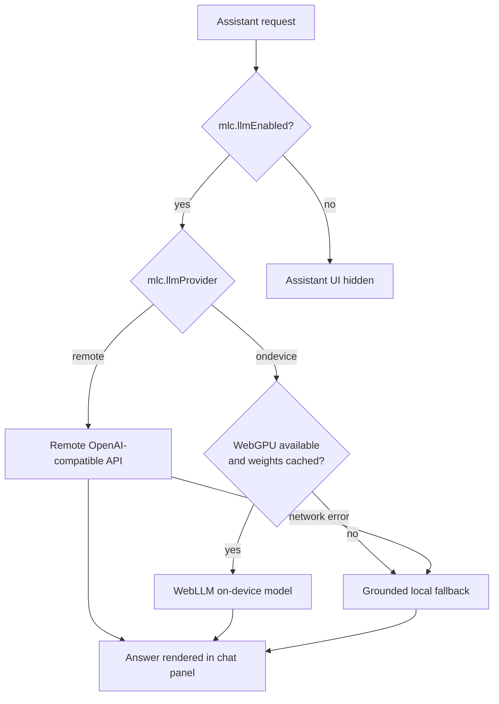
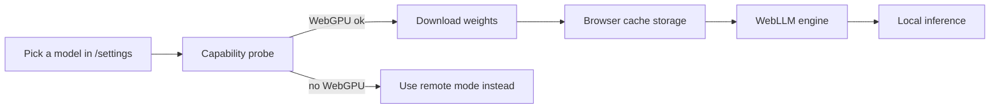
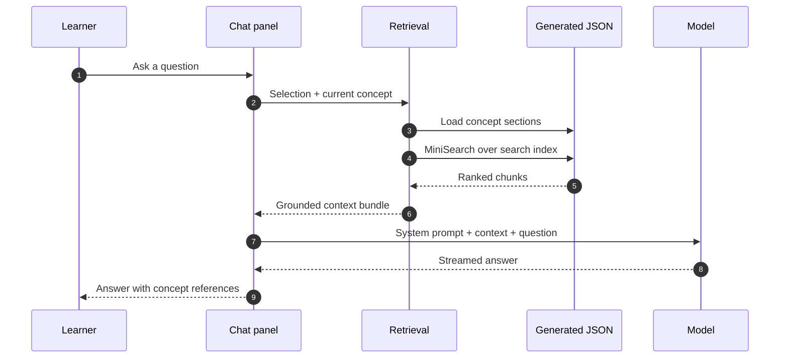
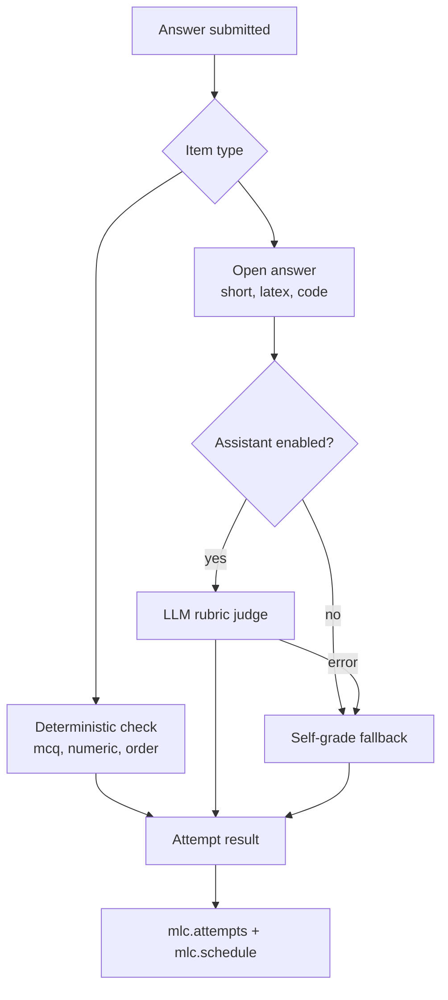
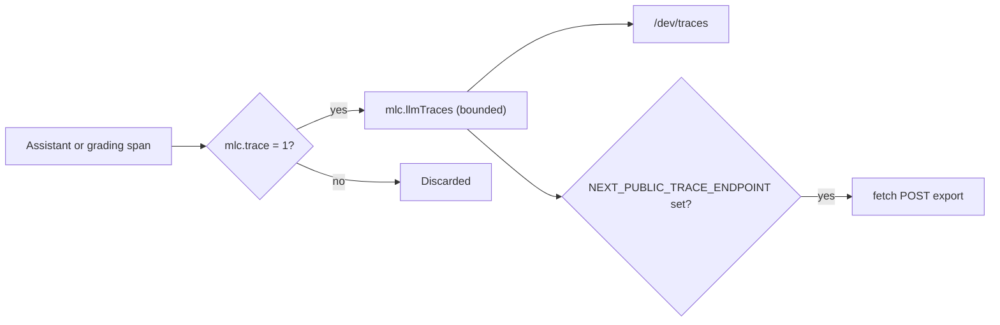

# Assistant

The app includes an optional assistant for concept questions and quiz explanation.

The assistant can use:

1. a remote OpenAI-compatible API
2. an on-device WebGPU model through WebLLM
3. a grounded local fallback when model generation is unavailable

## Mode selection



## Where settings live

Open:

```text
/settings
```

The settings page includes assistant configuration, health checks, model download controls, and backup options.

## Remote model mode

Remote mode expects an OpenAI-compatible chat-completions endpoint.

Typical base URL:

```text
https://api.openai.com/v1
```

Required fields:

- base URL
- model name
- API key
- max output tokens
- reasoning effort

The app calls:

```text
POST <baseUrl>/chat/completions
```

and may call:

```text
GET <baseUrl>/models
```

for health checks.

## On-device mode

On-device mode uses WebLLM and WebGPU.

Current model options are declared in:

```text
src/lib/llm/capability.ts
```

The app includes Qwen3 WebLLM model specs.

On-device mode requires:

- a browser with WebGPU
- enough storage quota
- enough GPU memory
- model weights downloaded into browser cache/storage



## Browser support

WebGPU support varies by browser and device.

If WebGPU is unavailable, use remote mode or leave the assistant off.

On iOS, install the app to the Home Screen before downloading large model weights. Storage quota is usually larger for installed web apps.

## Grounded context

Assistant prompts are grounded in:

- selected text
- current concept metadata
- nearby concept sections
- retrieved related note chunks



Generated section context comes from:

```text
public/data/concept-sections/*.json
```

Search chunks come from:

```text
public/data/search-index.json
```

## Grading

Quiz grading uses:

1. deterministic checks where possible
2. LLM rubric judging for open answers when assistant is enabled
3. self-grade fallback when grading is unavailable



Grading code lives in:

```text
src/lib/grading/
```

## Tracing

Tracing can be enabled by setting:

```text
localStorage["mlc.trace"] = "1"
```

Then open:

```text
/dev/traces
```

Trace storage is local and bounded.

If `NEXT_PUBLIC_TRACE_ENDPOINT` is set, spans may also be exported with `fetch`.


