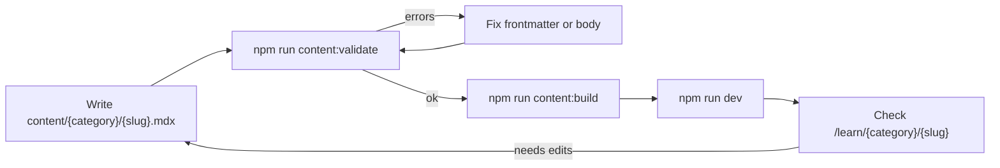
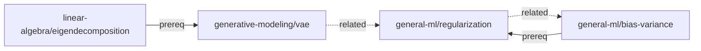
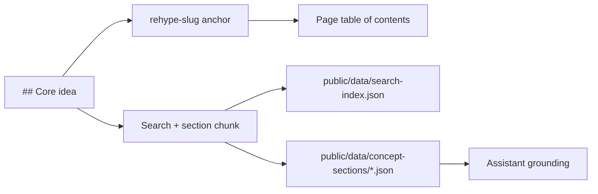

# Content authoring

Concept notes are authored as MDX files.

## Authoring loop



## File location

Use:

```text
content/<category>/<slug>.mdx
```

Example:

```text
content/general-ml/bias-variance.mdx
```

## Concept ID rule

The frontmatter `id` must match the path:

```text
<category>/<slug>
```

For:

```text
content/general-ml/bias-variance.mdx
```

use:

```yaml
id: general-ml/bias-variance
```

## Frontmatter

Example:

```yaml
---
id: general-ml/bias-variance
title: Bias-Variance Tradeoff
category: general-ml
summary: How expected generalisation error decomposes into bias, variance, and irreducible noise.
tags: [generalization, supervised-learning]
difficulty: 2
prereqs: []
related: []
estReadMin: 8
updated: 2026-01-01
---
```

## Required fields

| Field | Type | Notes |
| --- | --- | --- |
| `id` | string | Must match `<category>/<slug>` |
| `title` | string | Human-readable title |
| `category` | string | Category ID |
| `summary` | string | Short summary, max 200 chars in app schema |
| `tags` | string array | Can be empty |
| `difficulty` | integer | 1 to 5 |
| `prereqs` | string array | Concept IDs |
| `related` | string array | Concept IDs |
| `estReadMin` | integer | Estimated read time |
| `updated` | date/string | Usually `YYYY-MM-DD` |

## Categories

Category IDs are declared in `src/lib/content/categories.ts`.

Current categories:

```text
reinforcement-learning
llms
generative-modeling
applied-ml
general-ml
linear-algebra
```

## Concept graph

`prereqs` and `related` build the navigation graph between notes. Both fields
must reference existing concept IDs, or validation fails.



## Headings

Use `##` and `###` headings for the table of contents.

Example:

```md
## Core idea

### Why it matters
```

The app uses heading text to generate anchors and search sections.



## Math

Use standard Markdown math.

Inline:

```md
The likelihood is $p_\theta(y \mid x)$.
```

Display:

```md
$$
\mathcal{L}(\theta)
=
-\sum_i \log p_\theta(y_i \mid x_i)
$$
```

## Code

Use fenced code blocks:

````md
```python
def sigmoid(x):
    return 1 / (1 + np.exp(-x))
```
````

## Custom MDX components

### TLDR

```mdx
<TLDR>
A concise summary of the main idea.
</TLDR>
```

### Intuition

```mdx
<Intuition>
Plain-language explanation.
</Intuition>
```

### Pitfall

```mdx
<Pitfall>
A common misconception or failure mode.
</Pitfall>
```

### Proof

```mdx
<Proof title="Sketch" lines={5}>
Proof text.
</Proof>
```

### Derivation

```mdx
<Derivation title="Gradient">
Derivation text.
</Derivation>
```

### Example

```mdx
<Example title="Worked example">
Example text.
</Example>
```

### Aside

```mdx
<Aside title="Extra context">
Additional context.
</Aside>
```

## Validate content

After editing content:

```bash
npm run content:validate
```

Then regenerate static JSON:

```bash
npm run content:build
```

!!! note "Next step"
    A concept becomes quizzable as soon as a matching `.quiz.yaml` file exists.
    See [Quiz authoring](quiz-authoring.md).
