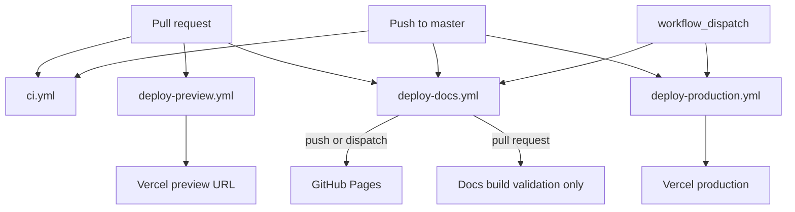
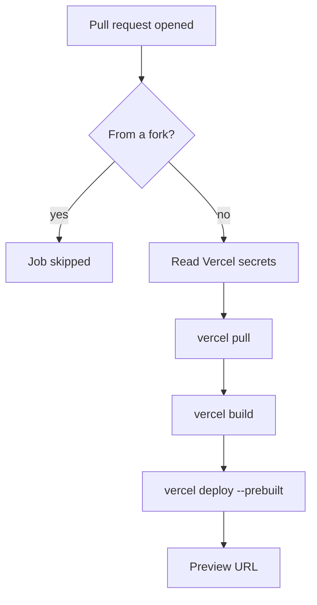
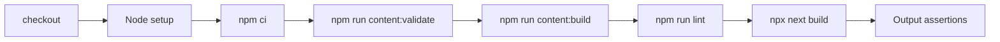
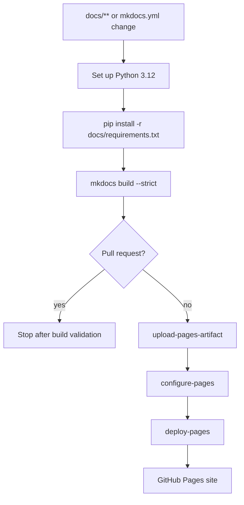

# Deployment

The repository has separate deployment paths for:

- the Next.js app on Vercel
- the MkDocs documentation on GitHub Pages

## Pipeline overview



## App deployment

App deployment workflows:

```text
.github/workflows/deploy-preview.yml
.github/workflows/deploy-production.yml
```

### Preview deployments

Preview deployments run on pull requests from the same repository.

Forked pull requests are skipped because GitHub does not expose repository secrets to forks.



Required secrets:

```text
VERCEL_TOKEN
VERCEL_ORG_ID
VERCEL_PROJECT_ID
```

### Production deployments

Production deployments run on:

- pushes to `master`
- manual `workflow_dispatch`

The production workflow uses:

```bash
vercel pull --environment=production
vercel build --prod
vercel deploy --prebuilt --prod
```

## CI

The CI workflow is:

```text
.github/workflows/ci.yml
```



## Documentation deployment

Docs are built with MkDocs Material and deployed through GitHub Pages.

Workflow:

```text
.github/workflows/deploy-docs.yml
```



It runs on:

- pushes to `master` that affect docs or `mkdocs.yml`
- manual dispatch
- pull requests for build validation only

## Enable GitHub Pages

In repository settings:

```text
Settings → Pages → Build and deployment → Source → GitHub Actions
```

No deployment secret is required for GitHub Pages when using the official Pages actions.

## Build docs locally

```bash
python -m pip install -r docs/requirements.txt
mkdocs build --strict
```

Serve docs locally:

```bash
mkdocs serve
```

!!! warning "Strict mode is on"
    `mkdocs.yml` sets `strict: true`, and the workflow also passes `--strict`.
    Broken internal links, missing nav files, or unknown extensions fail the build.
