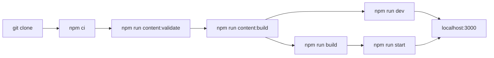

# Getting started

## Requirements

Install:

- Node.js `>=20.11.0`
- npm
- Python 3, if building documentation locally

The GitHub Actions workflows use Node.js 22.

## Local workflow



!!! tip "One command covers most of it"
    `npm run dev` and `npm run build` both run the content build for you.
    Run the individual scripts only when you want to inspect their output.

## Install app dependencies

```bash
npm ci
```

## Validate content

```bash
npm run content:validate
```

This validates MDX frontmatter and quiz YAML.

## Build generated content

```bash
npm run content:build
```

This generates static JSON under `public/data/`.

## Start development server

```bash
npm run dev
```

Open:

```text
http://localhost:3000
```

## Build the app

```bash
npm run build
```

This runs:

1. content validation
2. generated content build
3. Next.js build

## Serve static output

```bash
npm run start
```

The `start` script serves the `out/` directory.

## Build documentation locally

The documentation uses MkDocs Material with mermaid diagrams.

Install the docs toolchain:

```bash
python -m pip install -r docs/requirements.txt
```

Build:

```bash
mkdocs build --strict
```

Serve:

```bash
mkdocs serve
```

Open:

```text
http://127.0.0.1:8000
```

## Where to go next

- [Architecture](architecture.md) for how the pieces fit together
- [Content authoring](content-authoring.md) to add a concept note
- [Quiz authoring](quiz-authoring.md) to add quiz items
- [Troubleshooting](troubleshooting.md) when a build fails
