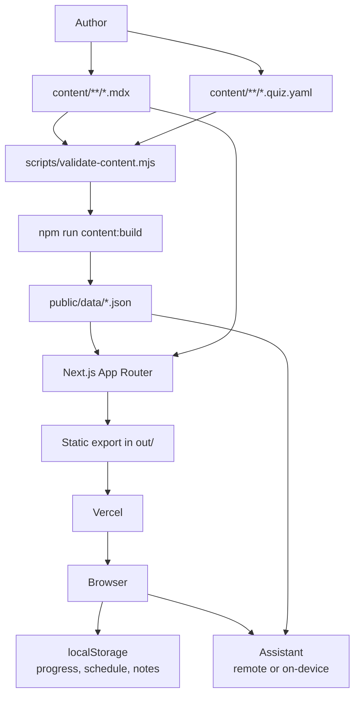

<section class="docs-hero">
  

    
Machine-learning revision app

    <h1>
      Learn, quiz, and review ML concepts.
    </h1>

    

      ML Concepts is a static-first Next.js app built from MDX notes and quiz
      YAML. Content is compiled into JSON at build time, and every learner
      record — attempts, review schedules, notes — stays in the browser.
    

    

      <a class="docs-button" href="getting-started/">
        Get started →
      </a>

      <a class="docs-button docs-button--secondary" href="content-authoring/">
        Author a concept
      </a>
    

  

  

    
Content pipeline

    <ol aria-label="Content pipeline">
      <li>Author MDX notes and quiz YAML</li>
      <li>Validate frontmatter and items</li>
      <li>Build search and section indexes</li>
      <li>Emit static JSON to public/data</li>
      <li>Render pages with the App Router</li>
      <li>Track progress in local storage</li>
    </ol>
  

</section>

<section class="docs-section">
  

    
Project overview

    <h2>Main components</h2>
    

      The app is deliberately simple: authored source under
      <code>content/</code>, generated JSON under <code>public/data/</code>,
      a static Next.js export, and browser-local learning state.
    

  

  

    <article class="docs-card">
      <h3>MDX concept notes</h3>
      

        Notes live in <code>content/&lt;category&gt;/&lt;slug&gt;.mdx</code> with typed
        frontmatter and custom components for TLDRs, intuitions, proofs, and
        pitfalls.
      

      MDX · frontmatter
    </article>

    <article class="docs-card">
      <h3>Generated static data</h3>
      

        Build scripts emit concept metadata, a MiniSearch index, per-concept
        section text, and normalized quiz items into <code>public/data/</code>.
      

      Node scripts · JSON
    </article>

    <article class="docs-card">
      <h3>Quizzes and grading</h3>
      

        MCQ, short, LaTeX, numeric, ordering, and code-cloze items graded
        deterministically, by LLM rubric, or by self-grade fallback.
      

      YAML · grading
    </article>

    <article class="docs-card">
      <h3>Spaced review</h3>
      

        Attempts feed an FSRS-based schedule so the review queue surfaces the
        concepts that are actually due.
      

      ts-fsrs · localStorage
    </article>

    <article class="docs-card">
      <h3>Optional assistant</h3>
      

        Remote OpenAI-compatible APIs, on-device WebLLM over WebGPU, or a
        grounded local fallback, all fed by retrieval over your notes.
      

      WebLLM · retrieval
    </article>

    <article class="docs-card">
      <h3>Two deploy targets</h3>
      

        The app ships to Vercel from GitHub Actions; this documentation is
        built with MkDocs Material and published to GitHub Pages.
      

      Vercel · GitHub Pages
    </article>
  

</section>

## Architecture

## Common tasks

| Task | Command |
| --- | --- |
| Install dependencies | `npm ci` |
| Validate content | `npm run content:validate` |
| Build generated data | `npm run content:build` |
| Run dev server | `npm run dev` |
| Typecheck/lint | `npm run lint` |
| Build app | `npm run build` |
| Serve docs locally | `mkdocs serve` |
| Build docs | `mkdocs build --strict` |

## Start here

- [Getting started](getting-started.md)
- [Architecture](architecture.md)
- [Content authoring](content-authoring.md)
- [Quiz authoring](quiz-authoring.md)
- [Assistant](assistant.md)
- [Deployment](deployment.md)
- [Troubleshooting](troubleshooting.md)
