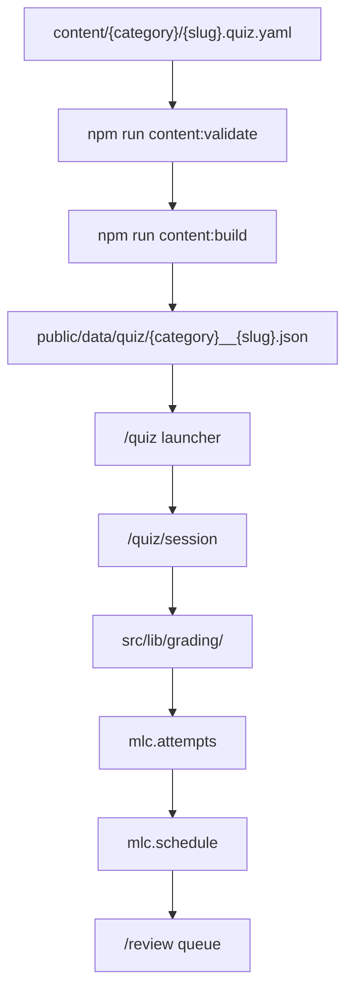
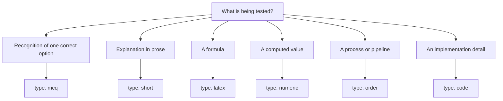

# Quiz authoring

Quiz files are YAML files that live beside concept MDX files.

For:

```text
content/general-ml/bias-variance.mdx
```

the quiz file is:

```text
content/general-ml/bias-variance.quiz.yaml
```

## From YAML to a graded attempt



## Quiz item fields

Common fields:

| Field | Type | Required | Notes |
| --- | --- | --- | --- |
| `id` | string | Recommended | Stable item ID |
| `type` | string | Yes | `mcq`, `short`, `latex`, `code`, `numeric`, or `order` |
| `prompt` | string | Yes | Question text |
| `difficulty` | integer | No | 1 to 5, defaults to 3 |
| `answer` | string | For many item types | Reference answer |
| `rubric` | string array | Recommended | Criteria for grading |
| `hints` | string array | Optional | Hints shown to learner |
| `explanation` | string | Optional | Explanation after answer |
| `anchor` | string | Optional | Link to section anchor |

## Choosing an item type



## Multiple choice

```yaml
- id: ols-objective
  type: mcq
  prompt: Which quantity is minimized by ordinary least squares?
  difficulty: 1
  options:
    - Sum of squared residuals
    - Sum of absolute residuals
    - Classification error
    - KL divergence
  correctIndex: 0
  explanation: Ordinary least squares minimizes the sum of squared residuals.
```

`correctIndex` is zero-based.

## Short answer

```yaml
- id: empirical-risk
  type: short
  prompt: Define empirical risk.
  difficulty: 2
  answer: The average loss over the training set.
  rubric:
    - Mentions loss
    - Mentions average or sum over the training examples
```

## LaTeX answer

```yaml
- id: mse-loss
  type: latex
  prompt: Write the squared error loss for one prediction.
  difficulty: 1
  answer: (y - \hat{y})^2
  rubric:
    - Gives an equivalent squared difference between target and prediction
```

## Numeric answer

```yaml
- id: absolute-error
  type: numeric
  prompt: If the target is 10 and the prediction is 8, what is the absolute error?
  difficulty: 1
  value: 2
  tolerance: 0.001
```

## Ordered steps

```yaml
- id: supervised-workflow
  type: order
  prompt: Put the supervised-learning workflow in order.
  difficulty: 1
  steps:
    - Collect labelled data
    - Fit model on training data
    - Evaluate on held-out data
    - Deploy or iterate
```

## Code cloze

```yaml
- id: mse-code
  type: code
  prompt: Fill in the missing NumPy expression.
  difficulty: 2
  lang: python
  scaffold: |
    import numpy as np

    def mse(y_hat, y):
        return ___BLANK_1___
  blanks:
    - id: 1
      answer: np.mean((y_hat - y) ** 2)
      rubric:
        - Computes the mean squared error
```

Every entry in `blanks` needs an `id`, a reference `answer`, and a non-empty `rubric`.
The learner types one value per blank; each blank is graded independently, so a
mostly-right answer with one wrong blank shows up as `partial`, not `incorrect`.

### Placeholder styles

The `scaffold` string can mark blanks in any of three ways — pick whichever
reads most naturally in the surrounding code, they are equivalent once loaded:

| Style | Example | Notes |
| --- | --- | --- |
| Canonical | `___BLANK_1___` | Explicit blank id. Use this when blanks are reordered or interleaved. |
| Numbered | `___1___` | Shorthand for `___BLANK_1___`. |
| Bare | `___` | Positional — the first `___` maps to the first entry in `blanks`, the second to the second, and so on. |

If `scaffold` is omitted entirely, one `___BLANK_{id}___` line is appended per
blank automatically. Placeholders are canonicalised client-side when the quiz
loads (`src/lib/quiz/normalize.ts`), so any of the three styles above is safe
to author directly — no build step rewrites them. `npm run content:validate`
checks that the number of placeholders in `scaffold` (once you've picked a
style) matches the number of entries in `blanks`.

## Two-stage grading

Every item is graded deterministically first — exact match against `answer`
(or, for `code`, against each blank's `answer`). `latex` and `code` answers
that fail the exact match are **not** immediately marked wrong: they fall
through to the LLM judge, which checks for mathematical/behavioural
equivalence (e.g. `\hat{y}^2` vs `y_hat**2`, or `np.mean((y_hat-y)**2)` vs
`((y_hat-y)**2).mean()`) using the item's `rubric` as the grading criteria.
If the assistant is off or the judge call fails, the learner is asked to
self-grade instead of being scored automatically — this is why every item
should carry a real, specific `rubric` even when the reference `answer` looks
unambiguous.

## Validation rules

Run:

```bash
npm run content:validate
```

The validator checks item shape and required fields per type:

- `mcq` — at least 2 `options`, and `correctIndex` in range
- `numeric` — a numeric `value`
- `order` — at least 2 `steps`
- `code` — a non-empty `blanks[]` with unique ids and a non-empty `answer` per
  blank, and (if `scaffold` uses one of the three placeholder styles) a
  placeholder count that matches `blanks.length`
- `latex` / `short` — a non-empty `answer` and a non-empty `rubric`

## Generated quiz data

Run:

```bash
npm run content:build
```

Quiz JSON is written to:

```text
public/data/quiz/<safe-concept-id>.json
```

Concept IDs are made filesystem-safe by replacing `/` with `__`.

Example:

```text
general-ml/bias-variance
```

becomes:

```text
general-ml__bias-variance.json
```

!!! tip "Write rubrics even for deterministic items"
    Rubrics are reused by the assistant when it explains a wrong answer,
    so they improve feedback quality even when grading is deterministic.
    See [Assistant](assistant.md).
