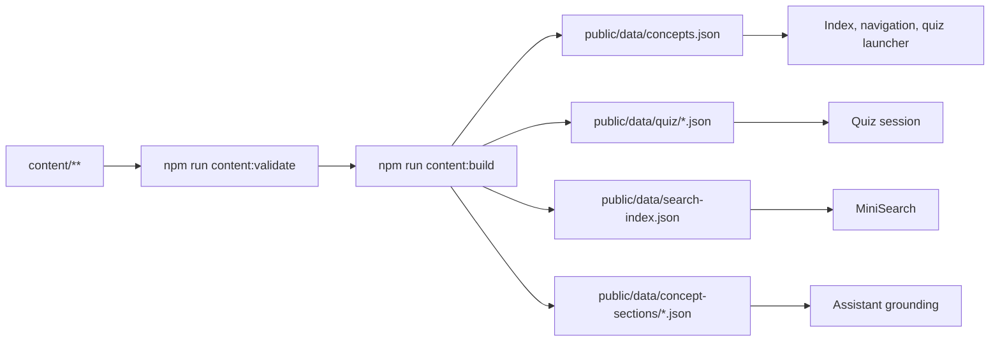
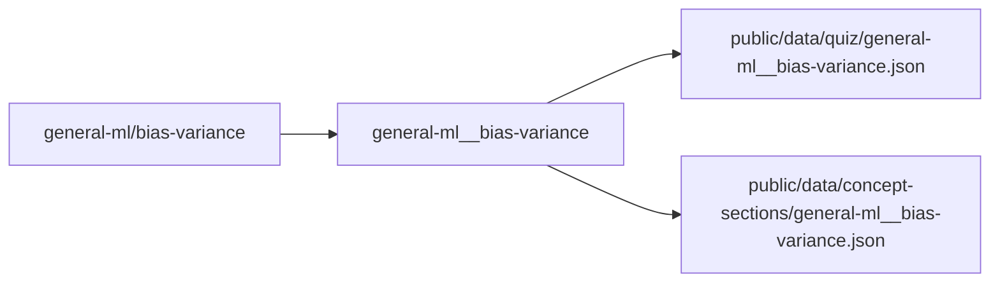

# Data files

Generated app data lives under:

```text
public/data/
```

Do not treat generated JSON as the source of truth. Source content lives under `content/`.

## Generation map



## `concepts.json`

Path:

```text
public/data/concepts.json
```

Generated by:

```bash
npm run content:build
```

Contains concept metadata derived from MDX frontmatter plus app fields:

- `slug`
- `href`
- `quizCount`
- `hasQuiz`

## Quiz JSON

Path pattern:

```text
public/data/quiz/<safe-concept-id>.json
```

Concept IDs are made safe by replacing `/` with `__`.



## Search index

Path:

```text
public/data/search-index.json
```

Generated from MDX content sections.

Used by:

```text
src/lib/retrieval/search.ts
```

## Concept sections

Path pattern:

```text
public/data/concept-sections/<safe-concept-id>.json
```

Used for assistant grounding and section ranking.

## Build scripts

Relevant scripts:

```text
scripts/validate-content.mjs
scripts/build-content.mjs
scripts/build-search-index.mjs
```

Package commands:

```bash
npm run content:validate
npm run content:build
```
