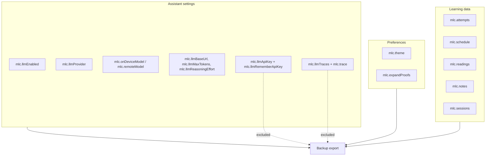
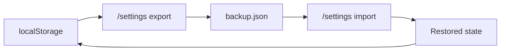

# Local storage

The app stores user learning state locally in the browser.

## State map



## Keys

| Key | Purpose |
| --- | --- |
| `mlc.attempts` | Quiz attempt records |
| `mlc.schedule` | Review schedule records |
| `mlc.readings` | Recent reading records |
| `mlc.notes` | Highlights and notes |
| `mlc.sessions` | Completed quiz sessions |
| `mlc.theme` | Light/dark theme |
| `mlc.expandProofs` | Expand collapsible proof/details preference |
| `mlc.llmEnabled` | Assistant enabled flag |
| `mlc.llmProvider` | `remote` or `ondevice` |
| `mlc.onDeviceModel` | Selected WebLLM model key |
| `mlc.remoteModel` | Remote model name |
| `mlc.llmBaseUrl` | Remote API base URL |
| `mlc.llmApiKey` | Optional remembered API key |
| `mlc.llmRememberApiKey` | Whether to persist API key |
| `mlc.llmMaxTokens` | Remote max output tokens |
| `mlc.llmReasoningEffort` | Reasoning effort preference |
| `mlc.llmTraces` | Local assistant/grading traces |
| `mlc.trace` | Enables tracing when set to `1` |

## Backup behavior



Backup export includes:

- attempts
- readings
- notes
- sessions
- non-secret settings

Backup export excludes:

- API keys
- browser caches
- downloaded model weights

Backup code lives in:

```text
src/lib/persistence/backup.ts
```

!!! warning "Local only"
    Nothing is synced to a server. Clearing site data, using a private window,
    or switching browsers loses progress unless you exported a backup first.

## Clearing local progress

The Settings page exposes controls for clearing learning data.

During development, you can also clear local storage in DevTools.
