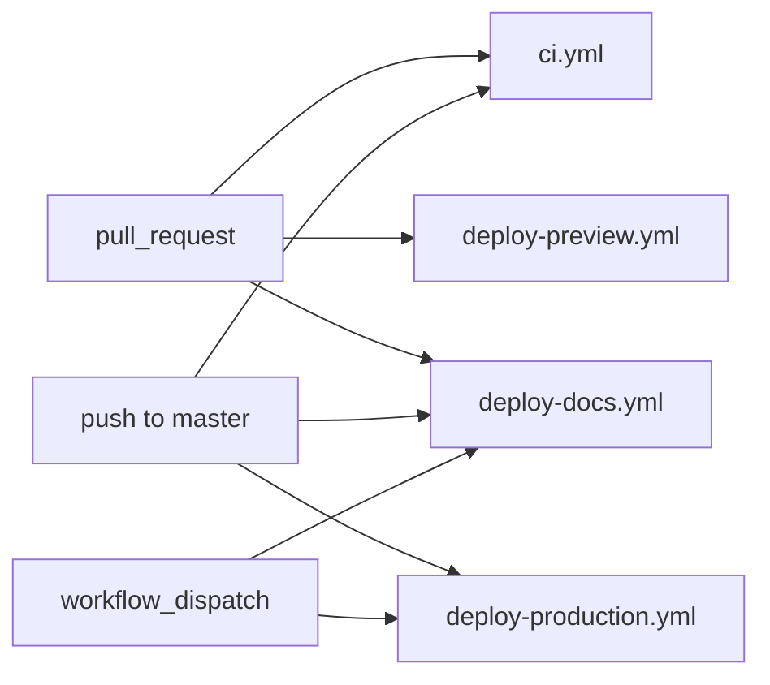
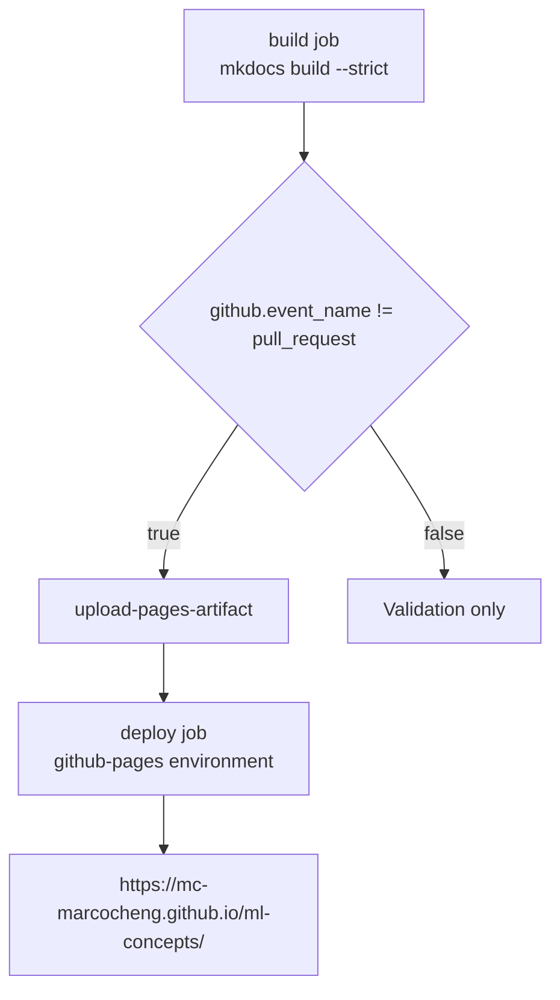

# GitHub workflows

Workflow files live in:

```text
.github/workflows/
```

## Trigger matrix



## CI

File:

```text
.github/workflows/ci.yml
```

Runs on:

- pull requests
- pushes to `master`

Main checks:

```bash
npm ci
npm run content:validate
npm run content:build
npm run lint
npx next build
```

## Vercel preview deployment

File:

```text
.github/workflows/deploy-preview.yml
```

Runs on pull requests from the same repository.

Skipped for forked PRs because secrets are unavailable.

Requires:

```text
VERCEL_TOKEN
VERCEL_ORG_ID
VERCEL_PROJECT_ID
```

## Vercel production deployment

File:

```text
.github/workflows/deploy-production.yml
```

Runs on:

- pushes to `master`
- manual dispatch

Uses the production Vercel environment.

## Docs deployment

File:

```text
.github/workflows/deploy-docs.yml
```

Runs on:

- pushes to `master` that affect docs
- manual dispatch
- pull requests for build validation



Deploys with GitHub Pages using official Pages actions.

Docs dependencies are pinned in:

```text
docs/requirements.txt
```
