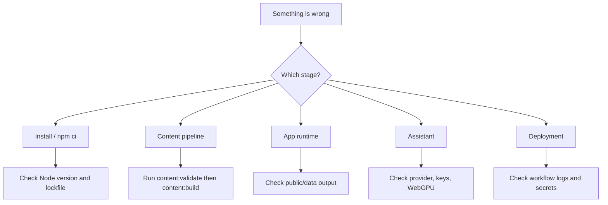
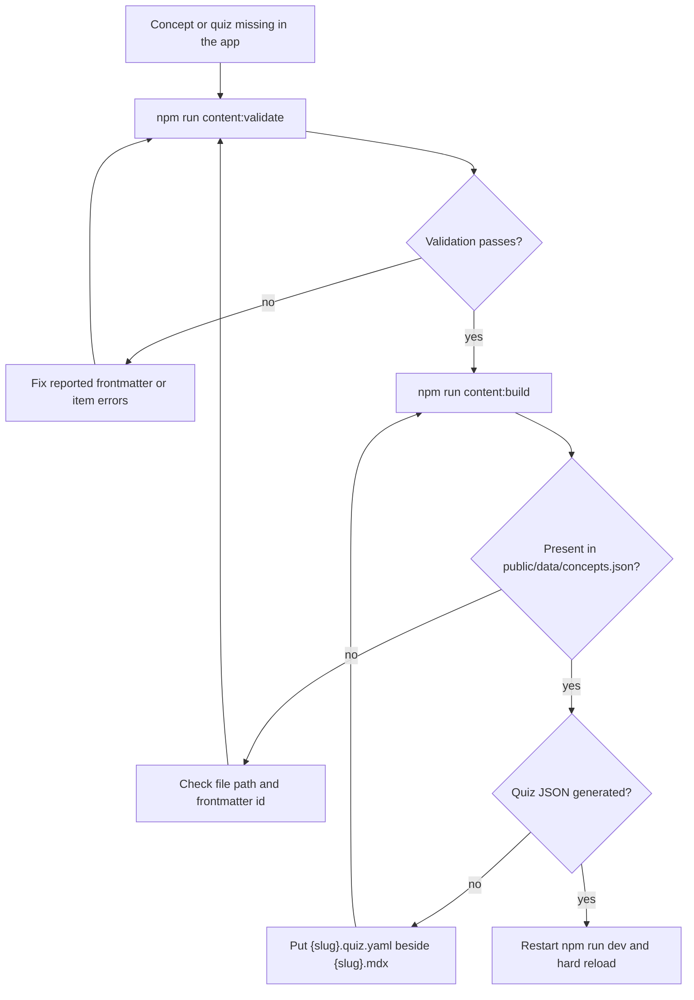
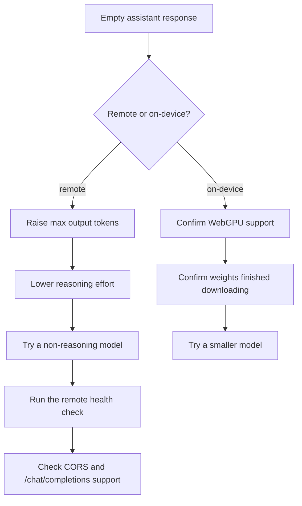

# Troubleshooting

## Where to start



## `npm ci` fails

Check:

- Node.js version is `>=20.11.0`
- `package-lock.json` exists
- npm is not using a stale global cache

Try:

```bash
node --version
npm --version
npm ci
```

## Content validation fails

Run:

```bash
npm run content:validate
```

Common causes:

- MDX frontmatter `id` does not match file path
- missing required frontmatter field
- `difficulty` is outside `1..5`
- `summary` is too long
- quiz item is missing `prompt`
- MCQ item is missing `options` or `correctIndex`
- prereq references an unknown concept

## Content does not show up



## Concept does not appear

Run:

```bash
npm run content:build
```

Check that the concept appears in:

```text
public/data/concepts.json
```

Also confirm:

- file ends in `.mdx`
- file is under a category directory
- frontmatter `id` matches `<category>/<slug>`

## Quiz does not appear

Check that the quiz file is beside the MDX file:

```text
content/<category>/<slug>.quiz.yaml
```

Run:

```bash
npm run content:validate
npm run content:build
```

Check generated output:

```text
public/data/quiz/<category>__<slug>.json
```

## Search result missing

Run:

```bash
npm run content:build
```

Search chunks are generated from MDX sections and written to:

```text
public/data/search-index.json
```

Make sure the content is not hidden inside syntax that the index stripper removes.

## Assistant returns empty response



Try:

- increasing max output tokens
- lowering reasoning effort
- using a non-reasoning model
- running the remote health check
- confirming the API base URL supports `/chat/completions`
- checking CORS headers if using a custom endpoint

## Remote model network error

Common causes:

- wrong base URL
- missing API key
- CORS blocked by provider
- browser offline
- endpoint does not implement OpenAI-compatible API

## On-device model fails

Check:

- browser supports WebGPU
- model weights are downloaded
- device has enough storage quota
- device has enough GPU memory
- browser is up to date

Try a smaller model.

## Docs deployment fails

Run locally:

```bash
python -m pip install -r docs/requirements.txt
mkdocs build --strict
```

Check:

- `mkdocs.yml` has valid nav paths
- all linked docs files exist
- mermaid fences use ```` ```mermaid ```` and valid syntax
- GitHub Pages source is set to GitHub Actions

## Vercel deployment fails

Check repository secrets:

```text
VERCEL_TOKEN
VERCEL_ORG_ID
VERCEL_PROJECT_ID
```

Also check the workflow logs for the failing command:

- `vercel pull`
- `vercel build`
- `vercel deploy`
